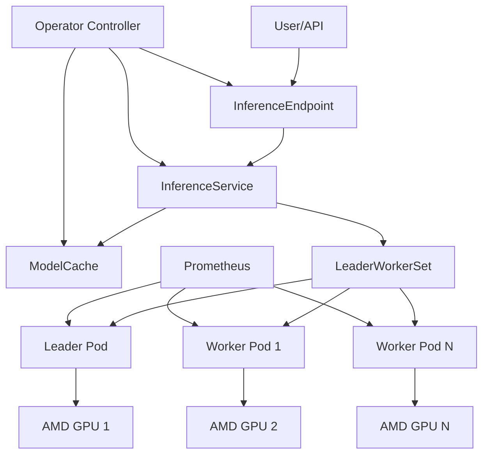

# AMD GPU Inference Kubernetes Operator - Developer-Ready Specification

## 🚀 Project Overview

A production-ready Kubernetes operator for managing large language model inference microservices at scale, specifically optimized for AMD GPUs and ROCm ecosystem. Built using lessons learned from analyzing k8s-nim-operator and aim-engine, this operator provides enterprise-grade distributed inference capabilities with intelligent GPU resource management.

**Target Use Cases:**
- Enterprise LLM inference workloads on AMD GPU clusters
- Multi-tenant inference services with cost optimization
- High-throughput inference with automatic scaling
- Distributed inference across multiple GPU nodes
- Development and production ML model serving

## 📋 Architectural Decisions Summary

| **Decision Area** | **Choice** | **Rationale** | **Implementation Priority** |
|-------------------|------------|---------------|---------------------------|
| **GPU Platform** | AMD GPUs + ROCm | Alternative to NVIDIA ecosystem, growing enterprise adoption | P0 - Core requirement |
| **Inference Backend** | vLLM (primary) | High performance, AMD GPU support, active development | P0 - Core requirement |
| **Language/Framework** | Go + Kubebuilder | Industry standard for operators, strong typing, performance | P0 - Core requirement |
| **CRD Strategy** | Service-oriented | `InferenceService`, `ModelCache`, `InferenceEndpoint` | P0 - Core architecture |
| **Scaling Pattern** | LeaderWorkerSet | Proven distributed inference pattern from NIM operator | P1 - Distributed inference |
| **Container Strategy** | Pre-built images | Faster deployment, consistent environments | P0 - Core requirement |
| **Storage Approach** | Flexible multi-backend | PVC, hostPath, object storage support | P0 - Core requirement |
| **vLLM Configuration** | Hybrid approach | Simple defaults + advanced override capabilities | P0 - Core feature |
| **GPU Management** | Multi-strategy | Static, dynamic, and topology-aware allocation | P1 - Advanced features |
| **Monitoring** | Basic metrics first | Prometheus integration, extensible foundation | P0 - Core requirement |
| **Distribution** | Helm charts | Balanced deployment flexibility and ease of use | P0 - Core requirement |

## 🎯 Implementation Priorities

### Phase 1 (P0) - MVP (Weeks 1-8)
**Goal**: Basic single-node inference with essential monitoring
- Core CRDs and controllers
- Single-node GPU allocation
- Basic vLLM integration
- Prometheus metrics
- Helm chart packaging

### Phase 2 (P1) - Production (Weeks 9-16)  
**Goal**: Distributed inference and advanced GPU management
- LeaderWorkerSet integration
- Multi-node distributed inference
- Dynamic GPU allocation
- Advanced autoscaling

### Phase 3 (P2) - Enterprise (Weeks 17-24)
**Goal**: Enterprise features and optimizations
- Multi-tenancy support
- Cost optimization
- Advanced monitoring

## 🏗️ Core Architecture

### System Components Overview



### Custom Resource Definitions (CRDs)

#### 1. InferenceService (Primary CRD)
**Purpose**: Main resource for managing inference workloads with complete lifecycle management.

```yaml
apiVersion: inference.ai/v1alpha1
kind: InferenceService
metadata:
  name: llama2-7b-service
  namespace: inference-system
  labels:
    model: "llama-2-7b"
    team: "ml-platform"
spec:
  # Model Configuration (Simple Interface)
  model:
    name: "llama-2-7b-chat"              # Required: Model identifier
    precision: "fp16"                     # Optional: fp16, fp32, int8, int4
    maxTokens: 4096                      # Optional: Max sequence length
    temperature: 0.7                     # Optional: Generation temperature
    
  # Advanced vLLM Configuration (Expert Interface)
  vllm:
    engineArgs:
      tensor_parallel_size: 2             # GPU parallelism within node
      pipeline_parallel_size: 1           # Node parallelism
      max_model_len: 8192                 # Override model max tokens
      gpu_memory_utilization: 0.9         # Memory utilization target
      enable_chunked_prefill: true        # Performance optimization
      max_num_batched_tokens: 2048        # Batch processing limit
      
  # Multi-Strategy GPU Management
  resources:
    strategy: "dynamic"                   # static|dynamic|topology-aware
    totalGpus: 4                         # Total GPU requirement
    autoOptimize: true                   # Auto tensor/pipeline parallelism
    cpuRequest: "4"                      # CPU cores per replica
    memoryRequest: "16Gi"                # Memory per replica
    
  # Distributed Inference Configuration
  distributed:
    enabled: true                        # Enable multi-node inference
    size: 2                             # Number of worker nodes
    backend: "lws"                      # LeaderWorkerSet backend
    mpi:
      enabled: true                     # Enable MPI communication
      timeout: 300                      # MPI initialization timeout
    
  # Storage Configuration
  storage:
    modelCache: "llama2-cache"          # Reference to ModelCache
    sharedMemory: "16Gi"                # Shared memory allocation
    readOnly: true                      # Mount model as read-only
    
  # Monitoring & Observability
  monitoring:
    enabled: true                       # Enable metrics collection
    prometheus:
      port: 9090                        # Metrics port
      path: "/metrics"                  # Metrics endpoint
      
  # Autoscaling Configuration
  autoscaling:
    enabled: true                       # Enable horizontal autoscaling
    minReplicas: 1                      # Minimum replica count
    maxReplicas: 5                      # Maximum replica count
    targetUtilization: 70               # Target CPU utilization
    scaleDownDelay: "300s"              # Scale down stabilization
    
  # Network & Security
  networking:
    serviceType: "ClusterIP"            # Service exposure type
    ports:
      http: 8000                        # HTTP API port
      grpc: 8001                        # gRPC API port (optional)
    ingress:
      enabled: false                    # Ingress configuration
      
status:
  conditions:
    - type: "Ready"
      status: "True"
      lastTransitionTime: "2025-01-01T00:00:00Z"
      reason: "InferenceReady"
      message: "Inference service is ready and accepting requests"
  replicas: 2                          # Current replica count
  readyReplicas: 2                     # Ready replica count
  endpoints:
    internal: "http://llama2-7b-service.inference-system.svc:8000"
    external: "https://llama2.example.com"  # If ingress enabled
  resourceUsage:
    gpuUtilization: 75                 # Current GPU utilization %
    memoryUsage: "12Gi"                # Current memory usage
  modelStatus:
    loaded: true                       # Model loading status
    loadTime: "45s"                    # Time to load model
    version: "v1.0.0"                  # Model version
```

#### 2. ModelCache
**Purpose**: Manages model storage, downloading, and caching across the cluster.

```yaml
apiVersion: inference.ai/v1alpha1
kind: ModelCache
metadata:
  name: llama2-cache
  namespace: inference-system
spec:
  modelName: "meta-llama/Llama-2-7b-chat-hf"   # HuggingFace model ID
  storageClass: "fast-ssd"                      # Kubernetes StorageClass
  size: "50Gi"                                  # Storage size requirement
  downloadPolicy: "IfNotPresent"               # Always|IfNotPresent|Never
  
  # Model Source Configuration
  source:
    type: "huggingface"                         # huggingface|s3|gcs|http
    huggingface:
      repository: "meta-llama/Llama-2-7b-chat-hf"
      revision: "main"                          # Git revision/branch
      tokenSecret: "hf-token-secret"            # Secret with HF token
    # Alternative: S3 source
    # s3:
    #   bucket: "my-models"
    #   key: "llama2-7b/"
    #   region: "us-west-2"
    #   credentialsSecret: "s3-credentials"
    
  # Caching Strategy
  caching:
    enabled: true                               # Enable persistent caching
    replicas: 3                                 # Cache replicas across nodes
    
status:
  phase: "Ready"                                # Pending|Downloading|Ready|Failed
  downloadProgress: 100                         # Download percentage
  sizeOnDisk: "47Gi"                           # Actual disk usage
  lastUpdated: "2025-01-01T00:00:00Z"
  conditions:
    - type: "Downloaded"
      status: "True"
      message: "Model successfully downloaded and cached"
```

#### 3. InferenceEndpoint
**Purpose**: Manages external access, load balancing, and routing for inference services.

```yaml
apiVersion: inference.ai/v1alpha1
kind: InferenceEndpoint
metadata:
  name: llama2-endpoint
  namespace: inference-system
spec:
  service: "llama2-7b-service"                  # Target InferenceService
  
  # Service Exposure
  expose:
    type: "LoadBalancer"                        # ClusterIP|NodePort|LoadBalancer
    ports:
      - name: "http-api"
        port: 8000
        protocol: "HTTP"
        targetPort: 8000
      - name: "grpc-api"
        port: 8001
        protocol: "gRPC"
        targetPort: 8001
        
  # Ingress Configuration
  ingress:
    enabled: true
    className: "nginx"                          # Ingress class
    host: "llama2.example.com"
    tls:
      enabled: true
      secretName: "llama2-tls"
    annotations:
      nginx.ingress.kubernetes.io/proxy-timeout: "300s"
      nginx.ingress.kubernetes.io/proxy-body-size: "10m"
      
  # Load Balancing & Routing
  routing:
    strategy: "round-robin"                     # round-robin|least-connections|weighted
    healthCheck:
      enabled: true
      path: "/health"
      interval: "30s"
      timeout: "5s"
      
status:
  endpoints:
    - name: "http-api"
      url: "http://llama2.example.com:8000"
      status: "Ready"
    - name: "grpc-api" 
      url: "grpc://llama2.example.com:8001"
      status: "Ready"
  conditions:
    - type: "Available"
      status: "True"
      message: "Endpoint is accessible and healthy"
```

## 🔧 Technical Implementation

### 1. Project Structure

```
inference-operator/
├── cmd/
│   └── main.go                          # Operator entry point
├── api/
│   └── v1alpha1/                        # CRD definitions
│       ├── inferenceservice_types.go
│       ├── modelcache_types.go
│       ├── inferenceendpoint_types.go
│       └── groupversion_info.go
├── internal/
│   ├── controller/                      # Controller implementations
│   │   ├── inferenceservice_controller.go
│   │   ├── modelcache_controller.go
│   │   └── inferenceendpoint_controller.go
│   ├── gpu/                            # GPU management
│   │   ├── allocator.go
│   │   ├── topology.go
│   │   └── monitor.go
│   ├── vllm/                           # vLLM integration
│   │   ├── config.go
│   │   ├── launcher.go
│   │   └── client.go
│   ├── storage/                        # Model storage management
│   │   ├── downloader.go
│   │   ├── cache.go
│   │   └── sources/
│   ├── monitoring/                     # Metrics and monitoring
│   │   ├── metrics.go
│   │   └── health.go
│   └── utils/                          # Shared utilities
│       ├── labels.go
│       ├── annotations.go
│       └── validation.go
├── config/
│   ├── crd/                           # CRD YAML definitions
│   ├── rbac/                          # RBAC configurations
│   ├── manager/                       # Manager deployment
│   └── samples/                       # Example resources
├── charts/                            # Helm charts
│   └── inference-operator/
├── scripts/                           # Build and deployment scripts
├── test/                              # Test suites
│   ├── unit/
│   ├── integration/
│   └── e2e/
└── docs/                              # Documentation
```

### 2. Controller Architecture

#### InferenceService Controller
**Primary controller managing the complete inference lifecycle.**

```go
package controller

import (
    "context"
    "fmt"
    "time"
    
    "k8s.io/apimachinery/pkg/runtime"
    ctrl "sigs.k8s.io/controller-runtime"
    "sigs.k8s.io/controller-runtime/pkg/client"
    "sigs.k8s.io/controller-runtime/pkg/log"
    
    inferencev1alpha1 "github.com/your-org/inference-operator/api/v1alpha1"
    "github.com/your-org/inference-operator/internal/gpu"
    "github.com/your-org/inference-operator/internal/vllm"
    "github.com/your-org/inference-operator/internal/monitoring"
)

// InferenceServiceReconciler reconciles InferenceService objects
type InferenceServiceReconciler struct {
    client.Client
    Scheme *runtime.Scheme
    
    // Component managers
    GPUAllocator     gpu.Allocator
    VLLMManager      vllm.Manager
    MonitoringManager monitoring.Manager
    
    // Configuration
    DefaultImage     string
    DefaultStorageClass string
}

// Reconcile implements the main reconciliation logic
func (r *InferenceServiceReconciler) Reconcile(ctx context.Context, req ctrl.Request) (ctrl.Result, error) {
    log := log.FromContext(ctx)
    
    // 1. Fetch InferenceService instance
    var inferenceService inferencev1alpha1.InferenceService
    if err := r.Get(ctx, req.NamespacedName, &inferenceService); err != nil {
        return ctrl.Result{}, client.IgnoreNotFound(err)
    }
    
    // 2. Validate configuration
    if err := r.validateSpec(&inferenceService); err != nil {
        log.Error(err, "Invalid InferenceService specification")
        return r.updateStatusWithError(ctx, &inferenceService, err)
    }
    
    // 3. Ensure ModelCache dependency
    if err := r.ensureModelCache(ctx, &inferenceService); err != nil {
        log.Error(err, "Failed to ensure ModelCache")
        return ctrl.Result{RequeueAfter: time.Minute}, err
    }
    
    // 4. Allocate GPU resources
    allocation, err := r.GPUAllocator.Allocate(ctx, &inferenceService.Spec.Resources)
    if err != nil {
        log.Error(err, "Failed to allocate GPU resources")
        return ctrl.Result{RequeueAfter: time.Minute * 2}, err
    }
    
    // 5. Create or update workload (Deployment or LeaderWorkerSet)
    if inferenceService.Spec.Distributed.Enabled {
        if err := r.reconcileLeaderWorkerSet(ctx, &inferenceService, allocation); err != nil {
            return ctrl.Result{RequeueAfter: time.Minute}, err
        }
    } else {
        if err := r.reconcileDeployment(ctx, &inferenceService, allocation); err != nil {
            return ctrl.Result{RequeueAfter: time.Minute}, err
        }
    }
    
    // 6. Configure service and networking
    if err := r.reconcileService(ctx, &inferenceService); err != nil {
        return ctrl.Result{RequeueAfter: time.Minute}, err
    }
    
    // 7. Setup monitoring
    if inferenceService.Spec.Monitoring.Enabled {
        if err := r.MonitoringManager.Setup(ctx, &inferenceService); err != nil {
            log.Error(err, "Failed to setup monitoring")
            // Non-fatal error, continue
        }
    }
    
    // 8. Update status
    return r.updateStatus(ctx, &inferenceService, allocation)
}

// validateSpec validates the InferenceService specification
func (r *InferenceServiceReconciler) validateSpec(svc *inferencev1alpha1.InferenceService) error {
    // Model validation
    if svc.Spec.Model.Name == "" {
        return fmt.Errorf("model name is required")
    }
    
    // GPU resource validation
    if svc.Spec.Resources.TotalGpus <= 0 {
        return fmt.Errorf("totalGpus must be greater than 0")
    }
    
    // Distributed configuration validation
    if svc.Spec.Distributed.Enabled {
        if svc.Spec.Distributed.Size <= 0 {
            return fmt.Errorf("distributed size must be greater than 0")
        }
        if svc.Spec.Autoscaling.Enabled {
            return fmt.Errorf("autoscaling cannot be enabled with distributed inference")
        }
    }
    
    return nil
}

// SetupWithManager sets up the controller with the Manager
func (r *InferenceServiceReconciler) SetupWithManager(mgr ctrl.Manager) error {
    return ctrl.NewControllerManagedBy(mgr).
        For(&inferencev1alpha1.InferenceService{}).
        Owns(&appsv1.Deployment{}).
        Owns(&lwsv1.LeaderWorkerSet{}).
        Owns(&corev1.Service{}).
        Complete(r)
}
```

### 3. GPU Resource Management

#### GPU Allocation Strategies
**Comprehensive GPU resource management supporting multiple allocation strategies.**

```go
package gpu

import (
    "context"
    "fmt"
    
    inferencev1alpha1 "github.com/your-org/inference-operator/api/v1alpha1"
)

// Allocator defines the GPU allocation interface
type Allocator interface {
    Allocate(ctx context.Context, spec *inferencev1alpha1.ResourceSpec) (*Allocation, error)
    Deallocate(ctx context.Context, allocation *Allocation) error
    GetAvailableGPUs(ctx context.Context) ([]GPUInfo, error)
}

// Allocation represents a GPU resource allocation
type Allocation struct {
    ID                string
    Strategy          string
    GPUs              []GPUAssignment
    TensorParallel    int
    PipelineParallel  int
    NodesRequired     int
    Topology          *Topology
}

// GPUAssignment represents a single GPU assignment
type GPUAssignment struct {
    NodeName    string
    DeviceID    string
    DeviceIndex int
    MemoryMB    int
}

// GPUInfo represents available GPU information
type GPUInfo struct {
    NodeName     string
    DeviceID     string
    DeviceIndex  int
    Model        string
    MemoryMB     int
    Available    bool
    Utilization  float64
}

// MultiStrategyAllocator implements multiple allocation strategies
type MultiStrategyAllocator struct {
    staticStrategy        *StaticAllocator
    dynamicStrategy       *DynamicAllocator
    topologyAwareStrategy *TopologyAwareAllocator
    topologyMap           map[string]*Topology
}

// Allocate allocates GPUs based on the specified strategy
func (m *MultiStrategyAllocator) Allocate(ctx context.Context, spec *inferencev1alpha1.ResourceSpec) (*Allocation, error) {
    switch spec.Strategy {
    case "static":
        return m.staticStrategy.Allocate(ctx, spec)
    case "dynamic":
        return m.dynamicStrategy.Allocate(ctx, spec)
    case "topology-aware":
        return m.topologyAwareStrategy.Allocate(ctx, spec)
    default:
        return nil, fmt.Errorf("unknown allocation strategy: %s", spec.Strategy)
    }
}

// StaticAllocator implements static GPU allocation
type StaticAllocator struct {
    client client.Client
}

func (s *StaticAllocator) Allocate(ctx context.Context, spec *inferencev1alpha1.ResourceSpec) (*Allocation, error) {
    // Simple round-robin allocation
    allocation := &Allocation{
        ID:               generateAllocationID(),
        Strategy:         "static",
        TensorParallel:   1,
        PipelineParallel: spec.TotalGpus,
        NodesRequired:    spec.TotalGpus,
    }
    
    // Get available nodes with GPUs
    nodes, err := s.getAvailableNodes(ctx)
    if err != nil {
        return nil, err
    }
    
    if len(nodes) < spec.TotalGpus {
        return nil, fmt.Errorf("insufficient GPU nodes: need %d, available %d", spec.TotalGpus, len(nodes))
    }
    
    // Assign one GPU per node
    for i := 0; i < spec.TotalGpus; i++ {
        allocation.GPUs = append(allocation.GPUs, GPUAssignment{
            NodeName:    nodes[i].Name,
            DeviceID:    nodes[i].GPUs[0].DeviceID,
            DeviceIndex: 0,
            MemoryMB:    nodes[i].GPUs[0].MemoryMB,
        })
    }
    
    return allocation, nil
}

// DynamicAllocator implements intelligent GPU allocation
type DynamicAllocator struct {
    client      client.Client
    topologyMap map[string]*Topology
}

func (d *DynamicAllocator) Allocate(ctx context.Context, spec *inferencev1alpha1.ResourceSpec) (*Allocation, error) {
    // Intelligent allocation based on model size and GPU memory
    modelSize := d.estimateModelSize(spec)
    
    allocation := &Allocation{
        ID:       generateAllocationID(),
        Strategy: "dynamic",
    }
    
    if spec.AutoOptimize {
        // Auto-optimize tensor and pipeline parallelism
        allocation.TensorParallel, allocation.PipelineParallel = d.optimizeParallelism(modelSize, spec.TotalGpus)
    } else {
        allocation.TensorParallel = 1
        allocation.PipelineParallel = spec.TotalGpus
    }
    
    // Select optimal nodes based on topology
    nodes, err := d.selectOptimalNodes(ctx, allocation.TensorParallel, allocation.PipelineParallel)
    if err != nil {
        return nil, err
    }
    
    // Assign GPUs to nodes
    for i, node := range nodes {
        for j := 0; j < allocation.TensorParallel; j++ {
            allocation.GPUs = append(allocation.GPUs, GPUAssignment{
                NodeName:    node.Name,
                DeviceID:    node.GPUs[j].DeviceID,
                DeviceIndex: j,
                MemoryMB:    node.GPUs[j].MemoryMB,
            })
        }
    }
    
    allocation.NodesRequired = len(nodes)
    return allocation, nil
}
```

### 4. vLLM Integration

#### Configuration Builder
**Hybrid configuration system supporting both simple and advanced vLLM configurations.**

```go
package vllm

import (
    "fmt"
    "strings"
    
    inferencev1alpha1 "github.com/your-org/inference-operator/api/v1alpha1"
    "github.com/your-org/inference-operator/internal/gpu"
)

// ConfigBuilder builds vLLM configuration from InferenceService spec
type ConfigBuilder struct {
    defaultConfigs map[string]interface{}
}

// BuildConfig builds the complete vLLM configuration
func (b *ConfigBuilder) BuildConfig(spec *inferencev1alpha1.InferenceServiceSpec, allocation *gpu.Allocation) (*Config, error) {
    config := &Config{
        ModelName: spec.Model.Name,
        Args:      []string{},
        EnvVars:   map[string]string{},
    }
    
    // Apply simple configuration
    if err := b.applySimpleConfig(config, &spec.Model); err != nil {
        return nil, err
    }
    
    // Apply GPU allocation configuration
    if err := b.applyGPUConfig(config, allocation); err != nil {
        return nil, err
    }
    
    // Apply advanced vLLM configuration (overrides simple config)
    if spec.VLLM != nil {
        if err := b.applyAdvancedConfig(config, spec.VLLM); err != nil {
            return nil, err
        }
    }
    
    // Apply distributed configuration
    if spec.Distributed.Enabled {
        if err := b.applyDistributedConfig(config, &spec.Distributed, allocation); err != nil {
            return nil, err
        }
    }
    
    return config, nil
}

// Config represents the complete vLLM configuration
type Config struct {
    ModelName string
    Args      []string
    EnvVars   map[string]string
    Command   []string
}

// applySimpleConfig applies simple model configuration
func (b *ConfigBuilder) applySimpleConfig(config *Config, model *inferencev1alpha1.ModelSpec) error {
    // Data type configuration
    if model.Precision != "" {
        config.Args = append(config.Args, fmt.Sprintf("--dtype=%s", model.Precision))
    }
    
    // Token limit configuration
    if model.MaxTokens > 0 {
        config.Args = append(config.Args, fmt.Sprintf("--max-model-len=%d", model.MaxTokens))
    }
    
    // Generation parameters
    if model.Temperature > 0 {
        config.Args = append(config.Args, fmt.Sprintf("--temperature=%f", model.Temperature))
    }
    
    return nil
}

// applyGPUConfig applies GPU-specific configuration
func (b *ConfigBuilder) applyGPUConfig(config *Config, allocation *gpu.Allocation) error {
    // Set GPU visibility
    var deviceIds []string
    for _, gpu := range allocation.GPUs {
        deviceIds = append(deviceIds, fmt.Sprintf("%d", gpu.DeviceIndex))
    }
    config.EnvVars["HIP_VISIBLE_DEVICES"] = strings.Join(deviceIds, ",")
    config.EnvVars["ROCM_VERSION"] = "6.0"
    
    // Tensor parallelism
    if allocation.TensorParallel > 1 {
        config.Args = append(config.Args, fmt.Sprintf("--tensor-parallel-size=%d", allocation.TensorParallel))
    }
    
    // Pipeline parallelism
    if allocation.PipelineParallel > 1 {
        config.Args = append(config.Args, fmt.Sprintf("--pipeline-parallel-size=%d", allocation.PipelineParallel))
    }
    
    return nil
}

// applyAdvancedConfig applies advanced vLLM configuration
func (b *ConfigBuilder) applyAdvancedConfig(config *Config, vllm *inferencev1alpha1.VLLMSpec) error {
    // Apply engine arguments (these override simple config)
    for key, value := range vllm.EngineArgs {
        arg := fmt.Sprintf("--%s=%v", strings.ReplaceAll(key, "_", "-"), value)
        config.Args = append(config.Args, arg)
    }
    
    // Apply environment variables
    for key, value := range vllm.EnvVars {
        config.EnvVars[key] = value
    }
    
    return nil
}

// Manager manages vLLM processes and lifecycle
type Manager struct {
    client client.Client
}

// StartInference starts a vLLM inference process
func (m *Manager) StartInference(ctx context.Context, config *Config) error {
    // Implementation for starting vLLM process
    // This would typically create a Deployment or LeaderWorkerSet
    return nil
}

// StopInference stops a vLLM inference process
func (m *Manager) StopInference(ctx context.Context, name string) error {
    // Implementation for stopping vLLM process
    return nil
}

// GetStatus gets the status of a vLLM inference process
func (m *Manager) GetStatus(ctx context.Context, name string) (*Status, error) {
    // Implementation for getting process status
    return &Status{}, nil
}

// Status represents vLLM process status
type Status struct {
    Ready            bool
    ModelLoaded      bool
    RequestsServed   int64
    AverageLatency   float64
    TokensPerSecond  float64
    GPUUtilization   float64
    MemoryUsage      float64
}
```

### 5. Data Handling & Storage Management

#### Model Storage Strategy
**Comprehensive model storage supporting multiple backends with intelligent caching.**

```go
package storage

import (
    "context"
    "fmt"
    "path/filepath"
    
    inferencev1alpha1 "github.com/your-org/inference-operator/api/v1alpha1"
)

// Manager handles model storage and caching operations
type Manager struct {
    client        client.Client
    defaultClass  string
    downloaders   map[string]Downloader
}

// Downloader defines interface for different model sources
type Downloader interface {
    Download(ctx context.Context, source *inferencev1alpha1.ModelSource, dest string) error
    Validate(ctx context.Context, source *inferencev1alpha1.ModelSource) error
    GetSize(ctx context.Context, source *inferencev1alpha1.ModelSource) (int64, error)
}

// HuggingFaceDownloader downloads models from HuggingFace Hub
type HuggingFaceDownloader struct {
    defaultToken string
}

func (h *HuggingFaceDownloader) Download(ctx context.Context, source *inferencev1alpha1.ModelSource, dest string) error {
    // Implementation for HuggingFace downloads
    hfSource := source.HuggingFace
    if hfSource == nil {
        return fmt.Errorf("HuggingFace source configuration is nil")
    }
    
    // Get authentication token
    token := h.defaultToken
    if hfSource.TokenSecret != "" {
        secret := &corev1.Secret{}
        if err := h.client.Get(ctx, types.NamespacedName{
            Name:      hfSource.TokenSecret,
            Namespace: "default", // Should be configurable
        }, secret); err != nil {
            return fmt.Errorf("failed to get token secret: %w", err)
        }
        token = string(secret.Data["token"])
    }
    
    // Download using git-lfs or HF Hub API
    return h.downloadModel(ctx, hfSource.Repository, hfSource.Revision, dest, token)
}

// S3Downloader downloads models from S3-compatible storage
type S3Downloader struct {
    client s3.Client
}

func (s *S3Downloader) Download(ctx context.Context, source *inferencev1alpha1.ModelSource, dest string) error {
    // Implementation for S3 downloads
    s3Source := source.S3
    if s3Source == nil {
        return fmt.Errorf("S3 source configuration is nil")
    }
    
    // Download from S3 bucket
    return s.downloadFromS3(ctx, s3Source.Bucket, s3Source.Key, dest)
}

// CacheManager manages model caching across nodes
type CacheManager struct {
    client client.Client
}

// EnsureModelCache ensures model is cached and available
func (c *CacheManager) EnsureModelCache(ctx context.Context, cache *inferencev1alpha1.ModelCache) error {
    // Check if PVC already exists
    pvc := &corev1.PersistentVolumeClaim{}
    pvcName := fmt.Sprintf("%s-cache", cache.Name)
    
    err := c.client.Get(ctx, types.NamespacedName{
        Name:      pvcName,
        Namespace: cache.Namespace,
    }, pvc)
    
    if err != nil && errors.IsNotFound(err) {
        // Create new PVC
        pvc = &corev1.PersistentVolumeClaim{
            ObjectMeta: metav1.ObjectMeta{
                Name:      pvcName,
                Namespace: cache.Namespace,
                Labels: map[string]string{
                    "app.kubernetes.io/name":      "inference-operator",
                    "app.kubernetes.io/component": "model-cache",
                    "inference.ai/model":          cache.Spec.ModelName,
                },
            },
            Spec: corev1.PersistentVolumeClaimSpec{
                AccessModes: []corev1.PersistentVolumeAccessMode{
                    corev1.ReadWriteMany, // Multi-node access
                },
                StorageClassName: &cache.Spec.StorageClass,
                Resources: corev1.ResourceRequirements{
                    Requests: corev1.ResourceList{
                        corev1.ResourceStorage: resource.MustParse(cache.Spec.Size),
                    },
                },
            },
        }
        
        if err := c.client.Create(ctx, pvc); err != nil {
            return fmt.Errorf("failed to create PVC: %w", err)
        }
    } else if err != nil {
        return fmt.Errorf("failed to get PVC: %w", err)
    }
    
    // Check if model needs downloading
    if cache.Spec.DownloadPolicy == "Always" || 
       (cache.Spec.DownloadPolicy == "IfNotPresent" && !c.isModelCached(ctx, cache)) {
        return c.downloadModel(ctx, cache)
    }
    
    return nil
}

// isModelCached checks if model is already cached
func (c *CacheManager) isModelCached(ctx context.Context, cache *inferencev1alpha1.ModelCache) bool {
    // Check if download job completed successfully
    job := &batchv1.Job{}
    jobName := fmt.Sprintf("%s-download", cache.Name)
    
    err := c.client.Get(ctx, types.NamespacedName{
        Name:      jobName,
        Namespace: cache.Namespace,
    }, job)
    
    if err != nil {
        return false
    }
    
    // Check job completion status
    for _, condition := range job.Status.Conditions {
        if condition.Type == batchv1.JobComplete && condition.Status == corev1.ConditionTrue {
            return true
        }
    }
    
    return false
}

// downloadModel creates a job to download the model
func (c *CacheManager) downloadModel(ctx context.Context, cache *inferencev1alpha1.ModelCache) error {
    job := &batchv1.Job{
        ObjectMeta: metav1.ObjectMeta{
            Name:      fmt.Sprintf("%s-download", cache.Name),
            Namespace: cache.Namespace,
            Labels: map[string]string{
                "app.kubernetes.io/name":      "inference-operator",
                "app.kubernetes.io/component": "model-downloader",
                "inference.ai/model":          cache.Spec.ModelName,
            },
        },
        Spec: batchv1.JobSpec{
            BackoffLimit: ptr.To[int32](3),
            Template: corev1.PodTemplateSpec{
                Spec: corev1.PodSpec{
                    RestartPolicy: corev1.RestartPolicyNever,
                    Containers: []corev1.Container{
                        {
                            Name:    "downloader",
                            Image:   "inference-operator/model-downloader:latest",
                            Command: []string{"/download.sh"},
                            Env: []corev1.EnvVar{
                                {
                                    Name:  "MODEL_NAME",
                                    Value: cache.Spec.ModelName,
                                },
                                {
                                    Name:  "SOURCE_TYPE",
                                    Value: cache.Spec.Source.Type,
                                },
                                {
                                    Name:  "DEST_PATH",
                                    Value: "/cache",
                                },
                            },
                            VolumeMounts: []corev1.VolumeMount{
                                {
                                    Name:      "cache",
                                    MountPath: "/cache",
                                },
                            },
                        },
                    },
                    Volumes: []corev1.Volume{
                        {
                            Name: "cache",
                            VolumeSource: corev1.VolumeSource{
                                PersistentVolumeClaim: &corev1.PersistentVolumeClaimVolumeSource{
                                    ClaimName: fmt.Sprintf("%s-cache", cache.Name),
                                },
                            },
                        },
                    },
                },
            },
        },
    }
    
    return c.client.Create(ctx, job)
}
```

### 6. Error Handling & Recovery Strategies

#### Comprehensive Error Handling Framework
**Robust error handling with automatic recovery and detailed diagnostics.**

```go
package errors

import (
    "fmt"
    "time"
    
    "k8s.io/apimachinery/pkg/api/errors"
    metav1 "k8s.io/apimachinery/pkg/apis/meta/v1"
)

// ErrorType defines categories of errors for different handling strategies
type ErrorType string

const (
    ErrorTypeTransient     ErrorType = "Transient"     // Temporary errors, retry
    ErrorTypePermanent     ErrorType = "Permanent"     // Permanent errors, manual intervention
    ErrorTypeConfiguration ErrorType = "Configuration" // Configuration errors, fix spec
    ErrorTypeResource      ErrorType = "Resource"      // Resource constraints, wait or scale
    ErrorTypeExternal      ErrorType = "External"      // External dependency errors
)

// InferenceError represents an operator-specific error with recovery context
type InferenceError struct {
    Type        ErrorType
    Component   string
    Message     string
    Cause       error
    Retryable   bool
    RetryAfter  time.Duration
    Context     map[string]string
}

func (e *InferenceError) Error() string {
    return fmt.Sprintf("[%s/%s] %s", e.Type, e.Component, e.Message)
}

// ErrorHandler provides centralized error handling logic
type ErrorHandler struct {
    maxRetries map[ErrorType]int
    backoff    map[ErrorType]time.Duration
}

// HandleError processes errors and determines recovery strategy
func (h *ErrorHandler) HandleError(err error, component string) (*RecoveryAction, error) {
    inferenceErr := h.classifyError(err, component)
    
    switch inferenceErr.Type {
    case ErrorTypeTransient:
        return &RecoveryAction{
            Type:       ActionRetry,
            Delay:      inferenceErr.RetryAfter,
            MaxRetries: h.maxRetries[ErrorTypeTransient],
        }, nil
        
    case ErrorTypeResource:
        return &RecoveryAction{
            Type:       ActionWaitAndRetry,
            Delay:      5 * time.Minute,
            MaxRetries: h.maxRetries[ErrorTypeResource],
        }, nil
        
    case ErrorTypeConfiguration:
        return &RecoveryAction{
            Type:    ActionRequireIntervention,
            Message: "Configuration error requires manual fix",
        }, inferenceErr
        
    case ErrorTypePermanent:
        return &RecoveryAction{
            Type:    ActionFail,
            Message: "Permanent error, manual intervention required",
        }, inferenceErr
        
    default:
        return &RecoveryAction{
            Type:       ActionRetry,
            Delay:      30 * time.Second,
            MaxRetries: 3,
        }, nil
    }
}

// classifyError categorizes errors for appropriate handling
func (h *ErrorHandler) classifyError(err error, component string) *InferenceError {
    if errors.IsNotFound(err) {
        return &InferenceError{
            Type:       ErrorTypeTransient,
            Component:  component,
            Message:    "Resource not found, may be created soon",
            Cause:      err,
            Retryable:  true,
            RetryAfter: 30 * time.Second,
        }
    }
    
    if errors.IsResourceExpired(err) || errors.IsServerTimeout(err) {
        return &InferenceError{
            Type:       ErrorTypeTransient,
            Component:  component,
            Message:    "API server timeout, retrying",
            Cause:      err,
            Retryable:  true,
            RetryAfter: 10 * time.Second,
        }
    }
    
    if errors.IsInvalid(err) || errors.IsBadRequest(err) {
        return &InferenceError{
            Type:      ErrorTypeConfiguration,
            Component: component,
            Message:   "Invalid configuration detected",
            Cause:     err,
            Retryable: false,
        }
    }
    
    if errors.IsInsufficientStorage(err) || errors.IsInsufficientQuota(err) {
        return &InferenceError{
            Type:       ErrorTypeResource,
            Component:  component,
            Message:    "Insufficient resources available",
            Cause:      err,
            Retryable:  true,
            RetryAfter: 2 * time.Minute,
        }
    }
    
    // Default to transient error
    return &InferenceError{
        Type:       ErrorTypeTransient,
        Component:  component,
        Message:    "Unknown error, treating as transient",
        Cause:      err,
        Retryable:  true,
        RetryAfter: 30 * time.Second,
    }
}

// RecoveryAction defines the action to take for error recovery
type RecoveryAction struct {
    Type       ActionType
    Delay      time.Duration
    MaxRetries int
    Message    string
}

type ActionType string

const (
    ActionRetry                ActionType = "Retry"
    ActionWaitAndRetry         ActionType = "WaitAndRetry"
    ActionRequireIntervention  ActionType = "RequireIntervention"
    ActionFail                 ActionType = "Fail"
)

// ConditionManager manages status conditions for resources
type ConditionManager struct{}

// SetCondition sets a condition on a resource status
func (c *ConditionManager) SetCondition(conditions *[]metav1.Condition, conditionType string, status metav1.ConditionStatus, reason, message string) {
    now := metav1.NewTime(time.Now())
    
    // Find existing condition
    for i, condition := range *conditions {
        if condition.Type == conditionType {
            // Update existing condition if status changed
            if condition.Status != status {
                (*conditions)[i].Status = status
                (*conditions)[i].LastTransitionTime = now
                (*conditions)[i].Reason = reason
                (*conditions)[i].Message = message
            }
            return
        }
    }
    
    // Add new condition
    *conditions = append(*conditions, metav1.Condition{
        Type:               conditionType,
        Status:             status,
        LastTransitionTime: now,
        Reason:             reason,
        Message:            message,
    })
}

// Common condition types
const (
    ConditionReady           = "Ready"
    ConditionModelLoaded     = "ModelLoaded"
    ConditionGPUAllocated    = "GPUAllocated"
    ConditionServiceReady    = "ServiceReady"
    ConditionHealthy         = "Healthy"
)

// Common condition reasons
const (
    ReasonSuccessful       = "Successful"
    ReasonFailed          = "Failed"
    ReasonPending         = "Pending"
    ReasonInProgress      = "InProgress"
    ReasonInsufficientGPU = "InsufficientGPU"
    ReasonModelNotFound   = "ModelNotFound"
    ReasonConfigError     = "ConfigurationError"
)
```

## 📦 Container Images & Deployment

### Base Images Strategy
**Layered container approach optimizing for performance and security.**

#### Core Images
```dockerfile
# Base ROCm runtime image
FROM rocm/pytorch:rocm6.0_ubuntu20.04_py3.9_pytorch_2.1.1 as base

# System dependencies
RUN apt-get update && apt-get install -y \
    git \
    git-lfs \
    curl \
    wget \
    openssh-client \
    && rm -rf /var/lib/apt/lists/*

# Install vLLM with ROCm support
RUN pip install --no-cache-dir \
    vllm[rocm]==0.3.0 \
    transformers==4.36.0 \
    accelerate==0.25.0 \
    datasets==2.16.0

# Set ROCm environment
ENV HIP_VISIBLE_DEVICES=0,1,2,3,4,5,6,7
ENV ROCM_VERSION=6.0
ENV PYTORCH_ROCM_ARCH=gfx908;gfx90a;gfx1030

# Leader container for distributed inference
FROM base as leader
COPY scripts/start-leader.sh /usr/local/bin/
COPY scripts/health-check.sh /usr/local/bin/
RUN chmod +x /usr/local/bin/*.sh

# Install MPI for distributed inference
RUN apt-get update && apt-get install -y \
    openmpi-bin \
    openmpi-common \
    libopenmpi-dev \
    && rm -rf /var/lib/apt/lists/*

ENTRYPOINT ["/usr/local/bin/start-leader.sh"]

# Worker container for distributed inference
FROM base as worker
COPY scripts/start-worker.sh /usr/local/bin/
COPY scripts/health-check.sh /usr/local/bin/
RUN chmod +x /usr/local/bin/*.sh

# Install MPI for distributed inference
RUN apt-get update && apt-get install -y \
    openmpi-bin \
    openmpi-common \
    libopenmpi-dev \
    openssh-server \
    && rm -rf /var/lib/apt/lists/*

# Configure SSH for MPI
RUN mkdir /var/run/sshd
RUN echo 'PasswordAuthentication no' >> /etc/ssh/sshd_config
RUN echo 'PubkeyAuthentication yes' >> /etc/ssh/sshd_config

ENTRYPOINT ["/usr/local/bin/start-worker.sh"]

# Model downloader utility
FROM base as downloader
RUN pip install --no-cache-dir \
    huggingface_hub==0.20.0 \
    boto3==1.34.0 \
    google-cloud-storage==2.10.0

COPY scripts/download.sh /usr/local/bin/
RUN chmod +x /usr/local/bin/download.sh

ENTRYPOINT ["/usr/local/bin/download.sh"]
```

#### Startup Scripts
```bash
#!/bin/bash
# start-leader.sh - Leader node startup script

set -e

# Initialize logging
exec > >(tee -a /var/log/inference.log) 2>&1
echo "$(date): Starting inference leader node"

# Wait for model to be available
MODEL_PATH="/model-store"
while [ ! -d "$MODEL_PATH" ] || [ -z "$(ls -A $MODEL_PATH)" ]; do
    echo "$(date): Waiting for model to be available at $MODEL_PATH"
    sleep 10
done

# Configure GPU visibility
if [ -n "$HIP_VISIBLE_DEVICES" ]; then
    echo "$(date): Using GPUs: $HIP_VISIBLE_DEVICES"
    export CUDA_VISIBLE_DEVICES=$HIP_VISIBLE_DEVICES
fi

# Configure distributed inference
if [ "$DISTRIBUTED_ENABLED" = "true" ]; then
    echo "$(date): Configuring distributed inference"
    
    # Wait for worker nodes to be ready
    if [ -n "$WORKER_HOSTS" ]; then
        IFS=',' read -ra HOSTS <<< "$WORKER_HOSTS"
        for host in "${HOSTS[@]}"; do
            echo "$(date): Waiting for worker $host to be ready"
            while ! nc -z "$host" 22; do
                sleep 5
            done
        done
    fi
    
    # Start MPI coordinator
    export OMPI_MCA_orte_keep_fqdn_hostnames=true
    export OMPI_MCA_plm_rsh_args="-o StrictHostKeyChecking=no"
fi

# Build vLLM command
VLLM_CMD="python -m vllm.entrypoints.openai.api_server"
VLLM_CMD="$VLLM_CMD --model $MODEL_NAME"
VLLM_CMD="$VLLM_CMD --host 0.0.0.0"
VLLM_CMD="$VLLM_CMD --port $SERVER_PORT"

# Add configured arguments
if [ -n "$VLLM_ARGS" ]; then
    VLLM_CMD="$VLLM_CMD $VLLM_ARGS"
fi

echo "$(date): Starting vLLM with command: $VLLM_CMD"
exec $VLLM_CMD
```

### Monitoring & Observability Implementation

#### Metrics Collection
**Comprehensive metrics for inference performance and resource utilization.**

```go
package monitoring

import (
    "context"
    "net/http"
    "time"
    
    "github.com/prometheus/client_golang/prometheus"
    "github.com/prometheus/client_golang/prometheus/promhttp"
    inferencev1alpha1 "github.com/your-org/inference-operator/api/v1alpha1"
)

// MetricsManager handles metrics collection and exposure
type MetricsManager struct {
    registry    *prometheus.Registry
    httpServer  *http.Server
    
    // Inference metrics
    requestsTotal     *prometheus.CounterVec
    requestDuration   *prometheus.HistogramVec
    tokensPerSecond   *prometheus.GaugeVec
    queueSize         *prometheus.GaugeVec
    
    // GPU metrics
    gpuUtilization    *prometheus.GaugeVec
    gpuMemoryUsed     *prometheus.GaugeVec
    gpuTemperature    *prometheus.GaugeVec
    
    // Model metrics
    modelLoadTime     *prometheus.HistogramVec
    modelMemoryUsage  *prometheus.GaugeVec
}

// NewMetricsManager creates a new metrics manager
func NewMetricsManager(port int) *MetricsManager {
    registry := prometheus.NewRegistry()
    
    manager := &MetricsManager{
        registry: registry,
        httpServer: &http.Server{
            Addr:    fmt.Sprintf(":%d", port),
            Handler: promhttp.HandlerFor(registry, promhttp.HandlerOpts{}),
        },
        
        // Initialize metrics
        requestsTotal: prometheus.NewCounterVec(
            prometheus.CounterOpts{
                Name: "inference_requests_total",
                Help: "Total number of inference requests",
            },
            []string{"model", "status", "endpoint"},
        ),
        
        requestDuration: prometheus.NewHistogramVec(
            prometheus.HistogramOpts{
                Name:    "inference_request_duration_seconds",
                Help:    "Duration of inference requests",
                Buckets: []float64{0.01, 0.05, 0.1, 0.5, 1, 2, 5, 10, 30},
            },
            []string{"model", "endpoint"},
        ),
        
        tokensPerSecond: prometheus.NewGaugeVec(
            prometheus.GaugeOpts{
                Name: "inference_tokens_per_second",
                Help: "Current tokens per second throughput",
            },
            []string{"model", "node"},
        ),
        
        queueSize: prometheus.NewGaugeVec(
            prometheus.GaugeOpts{
                Name: "inference_queue_size",
                Help: "Current size of inference request queue",
            },
            []string{"model", "node"},
        ),
        
        gpuUtilization: prometheus.NewGaugeVec(
            prometheus.GaugeOpts{
                Name: "gpu_utilization_percent",
                Help: "GPU utilization percentage",
            },
            []string{"node", "device", "model"},
        ),
        
        gpuMemoryUsed: prometheus.NewGaugeVec(
            prometheus.GaugeOpts{
                Name: "gpu_memory_used_bytes",
                Help: "GPU memory used in bytes",
            },
            []string{"node", "device", "model"},
        ),
        
        modelLoadTime: prometheus.NewHistogramVec(
            prometheus.HistogramOpts{
                Name:    "model_loading_duration_seconds",
                Help:    "Time taken to load models",
                Buckets: []float64{10, 30, 60, 120, 300, 600, 1200},
            },
            []string{"model", "node"},
        ),
    }
    
    // Register all metrics
    registry.MustRegister(manager.requestsTotal)
    registry.MustRegister(manager.requestDuration)
    registry.MustRegister(manager.tokensPerSecond)
    registry.MustRegister(manager.queueSize)
    registry.MustRegister(manager.gpuUtilization)
    registry.MustRegister(manager.gpuMemoryUsed)
    registry.MustRegister(manager.modelLoadTime)
    
    return manager
}

// Start starts the metrics HTTP server
func (m *MetricsManager) Start(ctx context.Context) error {
    go func() {
        if err := m.httpServer.ListenAndServe(); err != nil && err != http.ErrServerClosed {
            log.Error(err, "Metrics server failed")
        }
    }()
    
    <-ctx.Done()
    return m.httpServer.Shutdown(context.Background())
}

// RecordRequest records an inference request
func (m *MetricsManager) RecordRequest(model, status, endpoint string, duration time.Duration) {
    m.requestsTotal.WithLabelValues(model, status, endpoint).Inc()
    m.requestDuration.WithLabelValues(model, endpoint).Observe(duration.Seconds())
}

// UpdateThroughput updates throughput metrics
func (m *MetricsManager) UpdateThroughput(model, node string, tokensPerSec float64) {
    m.tokensPerSecond.WithLabelValues(model, node).Set(tokensPerSec)
}

// UpdateQueueSize updates queue size metrics
func (m *MetricsManager) UpdateQueueSize(model, node string, size float64) {
    m.queueSize.WithLabelValues(model, node).Set(size)
}

// UpdateGPUMetrics updates GPU utilization metrics
func (m *MetricsManager) UpdateGPUMetrics(node, device, model string, utilization, memoryUsed float64) {
    m.gpuUtilization.WithLabelValues(node, device, model).Set(utilization)
    m.gpuMemoryUsed.WithLabelValues(node, device, model).Set(memoryUsed)
}

// HealthChecker provides health check functionality
type HealthChecker struct {
    checks map[string]HealthCheckFunc
}

type HealthCheckFunc func(ctx context.Context) error

// RegisterCheck registers a health check function
func (h *HealthChecker) RegisterCheck(name string, check HealthCheckFunc) {
    h.checks[name] = check
}

// CheckHealth performs all registered health checks
func (h *HealthChecker) CheckHealth(ctx context.Context) map[string]error {
    results := make(map[string]error)
    
    for name, check := range h.checks {
        results[name] = check(ctx)
    }
    
    return results
}

// StandardHealthChecks returns common health checks
func StandardHealthChecks() map[string]HealthCheckFunc {
    return map[string]HealthCheckFunc{
        "model_loaded": func(ctx context.Context) error {
            // Check if model is loaded in vLLM
            return checkModelLoaded(ctx)
        },
        "gpu_available": func(ctx context.Context) error {
            // Check if GPUs are accessible
            return checkGPUAvailability(ctx)
        },
        "memory_usage": func(ctx context.Context) error {
            // Check memory usage levels
            return checkMemoryUsage(ctx)
        },
        "api_responsive": func(ctx context.Context) error {
            // Check if API is responding
            return checkAPIResponsive(ctx)
        },
    }
}
```

## 🚀 Deployment & Distribution

### Helm Chart Structure
**Production-ready Helm chart with configurable deployment options.**

```
inference-operator/
├── Chart.yaml
├── values.yaml
├── values-production.yaml
├── values-development.yaml
├── templates/
│   ├── deployment.yaml
│   ├── service.yaml
│   ├── rbac.yaml
│   ├── crd.yaml
│   ├── webhook.yaml
│   └── monitoring/
│       ├── servicemonitor.yaml
│       └── prometheusrule.yaml
├── crds/
│   ├── inference-service.yaml
│   ├── model-cache.yaml
│   └── inference-endpoint.yaml
└── examples/
    ├── simple-inference.yaml
    ├── distributed-inference.yaml
    └── cached-models.yaml
```

#### Chart Configuration
```yaml
# Chart.yaml
apiVersion: v2
name: inference-operator
description: Kubernetes operator for managing AMD GPU inference workloads
version: 0.1.0
appVersion: "0.1.0"
home: https://github.com/your-org/inference-operator
sources:
  - https://github.com/your-org/inference-operator
maintainers:
  - name: Infrastructure Team
    email: infra@your-org.com
keywords:
  - inference
  - machine-learning
  - amd
  - gpu
  - vllm
dependencies:
  - name: prometheus-operator
    version: "~45.0.0"
    repository: https://prometheus-community.github.io/helm-charts
    condition: monitoring.prometheus.enabled

# values.yaml - Main configuration
image:
  repository: your-registry/inference-operator
  tag: "v0.1.0"
  pullPolicy: IfNotPresent

replicaCount: 1

resources:
  limits:
    cpu: 500m
    memory: 512Mi
  requests:
    cpu: 100m
    memory: 128Mi

# Operator configuration
operator:
  namespace: inference-system
  
  # Webhook configuration
  webhook:
    enabled: true
    port: 9443
    certManager:
      enabled: true
    
  # Leader election
  leaderElection:
    enabled: true
    resourceName: inference-operator
    
  # Metrics
  metrics:
    enabled: true
    port: 8080
    path: /metrics

# Default inference images
inference:
  images:
    leader: your-registry/inference-leader:v0.1.0
    worker: your-registry/inference-worker:v0.1.0
    downloader: your-registry/model-downloader:v0.1.0
  
  # Default GPU configuration
  gpu:
    defaultStrategy: shared
    nodeSelector:
      accelerator: amd-gpu
    
  # Default storage configuration
  storage:
    defaultClass: fast-ssd
    cacheSize: 100Gi

# Monitoring configuration
monitoring:
  prometheus:
    enabled: true
    namespace: monitoring
    
  grafana:
    enabled: false
    dashboards:
      enabled: true
      
  serviceMonitor:
    enabled: true
    interval: 30s
    scrapeTimeout: 10s

# Security configuration
security:
  rbac:
    create: true
  
  podSecurityStandards:
    enforce: restricted
    
  networkPolicies:
    enabled: true
```

### Installation Procedures
**Step-by-step installation for different environments.**

#### Quick Start Installation
```bash
#!/bin/bash
# install.sh - Quick installation script

set -e

# Configuration
NAMESPACE=${NAMESPACE:-inference-system}
HELM_CHART=${HELM_CHART:-./helm/inference-operator}
VALUES_FILE=${VALUES_FILE:-values.yaml}

echo "Installing AMD GPU Inference Operator..."

# Create namespace
echo "Creating namespace: $NAMESPACE"
kubectl create namespace $NAMESPACE --dry-run=client -o yaml | kubectl apply -f -

# Add required labels
kubectl label namespace $NAMESPACE \
  pod-security.kubernetes.io/enforce=restricted \
  pod-security.kubernetes.io/audit=restricted \
  pod-security.kubernetes.io/warn=restricted \
  --overwrite

# Install CRDs first
echo "Installing Custom Resource Definitions..."
kubectl apply -f $HELM_CHART/crds/

# Install cert-manager if webhook is enabled
if [ "$WEBHOOK_ENABLED" = "true" ]; then
  echo "Installing cert-manager..."
  kubectl apply -f https://github.com/cert-manager/cert-manager/releases/download/v1.13.0/cert-manager.yaml
  
  # Wait for cert-manager to be ready
  kubectl wait --for=condition=available --timeout=300s deployment/cert-manager -n cert-manager
  kubectl wait --for=condition=available --timeout=300s deployment/cert-manager-webhook -n cert-manager
fi

# Install operator using Helm
echo "Installing operator with Helm..."
helm upgrade --install inference-operator $HELM_CHART \
  --namespace $NAMESPACE \
  --values $HELM_CHART/$VALUES_FILE \
  --wait \
  --timeout=600s

echo "Verifying installation..."
kubectl wait --for=condition=available --timeout=300s deployment/inference-operator -n $NAMESPACE

echo "Installation completed successfully!"
echo "To get started, apply an InferenceService:"
echo "kubectl apply -f $HELM_CHART/examples/simple-inference.yaml"
```

## 🧪 Testing Strategy

### Comprehensive Testing Framework
**Multi-layered testing approach ensuring reliability and performance.**

#### Test Structure
```
test/
├── unit/
│   ├── controller/
│   │   ├── inferenceservice_test.go
│   │   ├── modelcache_test.go
│   │   └── gpu_allocation_test.go
│   ├── webhook/
│   │   ├── validation_test.go
│   │   └── mutation_test.go
│   └── utils/
│       ├── vllm_config_test.go
│       └── storage_test.go
├── integration/
│   ├── operator_test.go
│   ├── controller_integration_test.go
│   └── webhook_integration_test.go
├── e2e/
│   ├── basic_inference_test.go
│   ├── distributed_inference_test.go
│   ├── model_caching_test.go
│   └── gpu_allocation_test.go
├── performance/
│   ├── throughput_test.go
│   ├── latency_test.go
│   └── resource_usage_test.go
└── fixtures/
    ├── inferenceservices/
    ├── modelcaches/
    └── nodes/
```

#### Unit Tests
```go
package controller

import (
    "context"
    "testing"
    "time"
    
    "github.com/stretchr/testify/assert"
    "github.com/stretchr/testify/require"
    metav1 "k8s.io/apimachinery/pkg/apis/meta/v1"
    "k8s.io/apimachinery/pkg/types"
    ctrl "sigs.k8s.io/controller-runtime"
    "sigs.k8s.io/controller-runtime/pkg/client/fake"
    
    inferencev1alpha1 "github.com/your-org/inference-operator/api/v1alpha1"
)

func TestInferenceServiceController_Reconcile(t *testing.T) {
    tests := []struct {
        name            string
        service         *inferencev1alpha1.InferenceService
        expectedStatus  inferencev1alpha1.InferenceServiceStatus
        expectError     bool
    }{
        {
            name: "simple inference service",
            service: &inferencev1alpha1.InferenceService{
                ObjectMeta: metav1.ObjectMeta{
                    Name:      "test-service",
                    Namespace: "default",
                },
                Spec: inferencev1alpha1.InferenceServiceSpec{
                    Model: inferencev1alpha1.ModelSpec{
                        Name:   "llama2-7b",
                        Source: "huggingface://meta-llama/Llama-2-7b-hf",
                    },
                    Resources: inferencev1alpha1.ResourceSpec{
                        GPU: inferencev1alpha1.GPUSpec{
                            Count:    1,
                            Strategy: "exclusive",
                        },
                    },
                },
            },
            expectedStatus: inferencev1alpha1.InferenceServiceStatus{
                Phase: inferencev1alpha1.InferenceServiceReady,
                Conditions: []inferencev1alpha1.Condition{
                    {
                        Type:   inferencev1alpha1.ConditionModelLoaded,
                        Status: metav1.ConditionTrue,
                    },
                },
            },
            expectError: false,
        },
        {
            name: "distributed inference service",
            service: &inferencev1alpha1.InferenceService{
                ObjectMeta: metav1.ObjectMeta{
                    Name:      "distributed-service",
                    Namespace: "default",
                },
                Spec: inferencev1alpha1.InferenceServiceSpec{
                    Model: inferencev1alpha1.ModelSpec{
                        Name:   "llama2-70b",
                        Source: "huggingface://meta-llama/Llama-2-70b-hf",
                    },
                    Resources: inferencev1alpha1.ResourceSpec{
                        GPU: inferencev1alpha1.GPUSpec{
                            Count:    4,
                            Strategy: "exclusive",
                        },
                    },
                    Distributed: &inferencev1alpha1.DistributedSpec{
                        Enabled:     true,
                        LeaderReplicas: 1,
                        WorkerReplicas: 3,
                    },
                },
            },
            expectedStatus: inferencev1alpha1.InferenceServiceStatus{
                Phase: inferencev1alpha1.InferenceServiceReady,
                Distributed: &inferencev1alpha1.DistributedStatus{
                    LeaderReady: 1,
                    WorkersReady: 3,
                },
            },
            expectError: false,
        },
    }
    
    for _, tt := range tests {
        t.Run(tt.name, func(t *testing.T) {
            // Setup fake client with test objects
            client := fake.NewClientBuilder().
                WithScheme(scheme).
                WithObjects(tt.service).
                Build()
            
            reconciler := &InferenceServiceReconciler{
                Client: client,
                Scheme: scheme,
                GPUAllocator: &MockGPUAllocator{},
                VLLMConfigBuilder: &MockVLLMConfigBuilder{},
            }
            
            // Execute reconciliation
            req := ctrl.Request{
                NamespacedName: types.NamespacedName{
                    Name:      tt.service.Name,
                    Namespace: tt.service.Namespace,
                },
            }
            
            result, err := reconciler.Reconcile(context.TODO(), req)
            
            // Verify results
            if tt.expectError {
                assert.Error(t, err)
            } else {
                assert.NoError(t, err)
                assert.False(t, result.Requeue)
            }
            
            // Check status updates
            var updated inferencev1alpha1.InferenceService
            err = client.Get(context.TODO(), req.NamespacedName, &updated)
            require.NoError(t, err)
            
            assert.Equal(t, tt.expectedStatus.Phase, updated.Status.Phase)
        })
    }
}

func TestGPUAllocation(t *testing.T) {
    allocator := NewGPUAllocator(fake.NewClientBuilder().Build())
    
    tests := []struct {
        name        string
        strategy    string
        required    int
        available   []GPUNode
        expectError bool
    }{
        {
            name:     "exclusive allocation success",
            strategy: "exclusive",
            required: 2,
            available: []GPUNode{
                {Name: "node1", GPUs: 4, Available: 4},
                {Name: "node2", GPUs: 4, Available: 4},
            },
            expectError: false,
        },
        {
            name:     "shared allocation success",
            strategy: "shared",
            required: 2,
            available: []GPUNode{
                {Name: "node1", GPUs: 4, Available: 2},
                {Name: "node2", GPUs: 4, Available: 3},
            },
            expectError: false,
        },
        {
            name:     "insufficient resources",
            strategy: "exclusive",
            required: 8,
            available: []GPUNode{
                {Name: "node1", GPUs: 4, Available: 4},
            },
            expectError: true,
        },
    }
    
    for _, tt := range tests {
        t.Run(tt.name, func(t *testing.T) {
            allocation, err := allocator.AllocateGPUs(
                context.TODO(),
                tt.strategy,
                tt.required,
                tt.available,
            )
            
            if tt.expectError {
                assert.Error(t, err)
                assert.Nil(t, allocation)
            } else {
                assert.NoError(t, err)
                assert.NotNil(t, allocation)
                assert.Equal(t, tt.required, len(allocation.GPUs))
            }
        })
    }
}
```

#### End-to-End Tests
```go
package e2e

import (
    "context"
    "fmt"
    "testing"
    "time"
    
    "github.com/stretchr/testify/assert"
    "github.com/stretchr/testify/suite"
    appsv1 "k8s.io/api/apps/v1"
    metav1 "k8s.io/apimachinery/pkg/apis/meta/v1"
    "k8s.io/apimachinery/pkg/types"
    "k8s.io/apimachinery/pkg/util/wait"
    "sigs.k8s.io/controller-runtime/pkg/client"
    
    inferencev1alpha1 "github.com/your-org/inference-operator/api/v1alpha1"
)

type E2ETestSuite struct {
    suite.Suite
    client    client.Client
    namespace string
}

func (s *E2ETestSuite) SetupSuite() {
    // Setup test environment
    s.namespace = fmt.Sprintf("e2e-test-%d", time.Now().Unix())
    
    // Create test namespace
    ns := &corev1.Namespace{
        ObjectMeta: metav1.ObjectMeta{
            Name: s.namespace,
        },
    }
    s.Require().NoError(s.client.Create(context.TODO(), ns))
}

func (s *E2ETestSuite) TearDownSuite() {
    // Cleanup test namespace
    ns := &corev1.Namespace{
        ObjectMeta: metav1.ObjectMeta{
            Name: s.namespace,
        },
    }
    s.client.Delete(context.TODO(), ns)
}

func (s *E2ETestSuite) TestBasicInferenceService() {
    // Create inference service
    service := &inferencev1alpha1.InferenceService{
        ObjectMeta: metav1.ObjectMeta{
            Name:      "basic-test",
            Namespace: s.namespace,
        },
        Spec: inferencev1alpha1.InferenceServiceSpec{
            Model: inferencev1alpha1.ModelSpec{
                Name:   "llama2-7b",
                Source: "huggingface://meta-llama/Llama-2-7b-hf",
            },
            Resources: inferencev1alpha1.ResourceSpec{
                GPU: inferencev1alpha1.GPUSpec{
                    Count:    1,
                    Strategy: "shared",
                },
            },
        },
    }
    
    s.Require().NoError(s.client.Create(context.TODO(), service))
    
    // Wait for service to be ready
    s.Eventually(func() bool {
        var updated inferencev1alpha1.InferenceService
        err := s.client.Get(context.TODO(), 
            types.NamespacedName{Name: service.Name, Namespace: service.Namespace},
            &updated)
        if err != nil {
            return false
        }
        return updated.Status.Phase == inferencev1alpha1.InferenceServiceReady
    }, 5*time.Minute, 10*time.Second)
    
    // Verify deployment exists
    var deployment appsv1.Deployment
    err := s.client.Get(context.TODO(),
        types.NamespacedName{Name: "basic-test-leader", Namespace: s.namespace},
        &deployment)
    s.Require().NoError(err)
    s.Assert().Equal(int32(1), *deployment.Spec.Replicas)
    
    // Test inference endpoint
    s.testInferenceEndpoint(service.Name)
}

func (s *E2ETestSuite) TestDistributedInferenceService() {
    // Create distributed inference service
    service := &inferencev1alpha1.InferenceService{
        ObjectMeta: metav1.ObjectMeta{
            Name:      "distributed-test",
            Namespace: s.namespace,
        },
        Spec: inferencev1alpha1.InferenceServiceSpec{
            Model: inferencev1alpha1.ModelSpec{
                Name:   "llama2-70b",
                Source: "huggingface://meta-llama/Llama-2-70b-hf",
            },
            Resources: inferencev1alpha1.ResourceSpec{
                GPU: inferencev1alpha1.GPUSpec{
                    Count:    4,
                    Strategy: "exclusive",
                },
            },
            Distributed: &inferencev1alpha1.DistributedSpec{
                Enabled:        true,
                LeaderReplicas: 1,
                WorkerReplicas: 3,
            },
        },
    }
    
    s.Require().NoError(s.client.Create(context.TODO(), service))
    
    // Wait for distributed service to be ready
    s.Eventually(func() bool {
        var updated inferencev1alpha1.InferenceService
        err := s.client.Get(context.TODO(),
            types.NamespacedName{Name: service.Name, Namespace: service.Namespace},
            &updated)
        if err != nil {
            return false
        }
        
        return updated.Status.Phase == inferencev1alpha1.InferenceServiceReady &&
               updated.Status.Distributed != nil &&
               updated.Status.Distributed.LeaderReady == 1 &&
               updated.Status.Distributed.WorkersReady == 3
    }, 10*time.Minute, 15*time.Second)
    
    // Verify LeaderWorkerSet exists
    var lws inferencev1alpha1.LeaderWorkerSet
    err := s.client.Get(context.TODO(),
        types.NamespacedName{Name: "distributed-test", Namespace: s.namespace},
        &lws)
    s.Require().NoError(err)
}

func (s *E2ETestSuite) testInferenceEndpoint(serviceName string) {
    // Port forward to service
    // Make HTTP request to test inference
    // Verify response format and timing
}

func TestE2E(t *testing.T) {
    if testing.Short() {
        t.Skip("Skipping E2E tests in short mode")
    }
    
    suite.Run(t, new(E2ETestSuite))
}
```

#### Performance Tests
```go
package performance

import (
    "context"
    "fmt"
    "sync"
    "testing"
    "time"
    
    "github.com/stretchr/testify/assert"
)

func TestInferenceThroughput(t *testing.T) {
    client := setupInferenceClient()
    
    tests := []struct {
        name           string
        modelSize      string
        concurrency    int
        duration       time.Duration
        expectedTPS    float64
    }{
        {
            name:        "7B model low concurrency",
            modelSize:   "7b",
            concurrency: 4,
            duration:    2 * time.Minute,
            expectedTPS: 50.0,
        },
        {
            name:        "7B model high concurrency",
            modelSize:   "7b",
            concurrency: 16,
            duration:    2 * time.Minute,
            expectedTPS: 80.0,
        },
        {
            name:        "70B model distributed",
            modelSize:   "70b",
            concurrency: 8,
            duration:    5 * time.Minute,
            expectedTPS: 20.0,
        },
    }
    
    for _, tt := range tests {
        t.Run(tt.name, func(t *testing.T) {
            tps := measureThroughput(client, tt.concurrency, tt.duration)
            assert.GreaterOrEqual(t, tps, tt.expectedTPS,
                "Throughput below expected threshold")
        })
    }
}

func measureThroughput(client InferenceClient, concurrency int, duration time.Duration) float64 {
    ctx, cancel := context.WithTimeout(context.Background(), duration)
    defer cancel()
    
    var wg sync.WaitGroup
    requestCount := int64(0)
    
    for i := 0; i < concurrency; i++ {
        wg.Add(1)
        go func() {
            defer wg.Done()
            
            for {
                select {
                case <-ctx.Done():
                    return
                default:
                    err := makeInferenceRequest(client)
                    if err == nil {
                        atomic.AddInt64(&requestCount, 1)
                    }
                }
            }
        }()
    }
    
    wg.Wait()
    return float64(requestCount) / duration.Seconds()
}
```

### CI/CD Integration
**Automated testing and deployment pipeline.**

```yaml
# .github/workflows/test.yml
name: Test

on:
  push:
    branches: [ main, develop ]
  pull_request:
    branches: [ main ]

jobs:
  unit-tests:
    runs-on: ubuntu-latest
    steps:
    - uses: actions/checkout@v4
    - uses: actions/setup-go@v4
      with:
        go-version: '1.21'
    
    - name: Run unit tests
      run: |
        make test-unit
        
    - name: Upload coverage
      uses: codecov/codecov-action@v3
      with:
        file: ./coverage.out

  integration-tests:
    runs-on: ubuntu-latest
    needs: unit-tests
    steps:
    - uses: actions/checkout@v4
    - uses: actions/setup-go@v4
      with:
        go-version: '1.21'
    
    - name: Start kind cluster
      uses: helm/kind-action@v1.8.0
      with:
        cluster_name: test-cluster
        
    - name: Run integration tests
      run: |
        make test-integration

  e2e-tests:
    runs-on: [self-hosted, amd-gpu]
    needs: integration-tests
    if: github.event_name == 'push'
    steps:
    - uses: actions/checkout@v4
    - uses: actions/setup-go@v4
      with:
        go-version: '1.21'
        
    - name: Setup test cluster
      run: |
        make setup-e2e-cluster
        
    - name: Run E2E tests
      run: |
        make test-e2e
        
    - name: Cleanup
      if: always()
      run: |
        make cleanup-e2e-cluster

---

## 📚 Appendices

### A. Technical Decision Records

#### ADR-001: AMD GPU Focus
**Decision**: Target AMD GPUs as primary platform  
**Rationale**: Market opportunity, ROCm ecosystem maturity, differentiation from NVIDIA-focused solutions  
**Implications**: ROCm dependency, specialized testing requirements, hardware-specific optimizations

#### ADR-002: vLLM Integration Approach
**Decision**: Hybrid configuration with simple defaults and advanced overrides  
**Rationale**: Balance ease of use with flexibility, leverage vLLM's capabilities, maintain upgradeability  
**Implications**: Configuration complexity, version compatibility management, documentation overhead

#### ADR-003: Service-Oriented CRD Design
**Decision**: Multiple focused CRDs over single monolithic CRD  
**Rationale**: Clear separation of concerns, independent lifecycle management, easier testing  
**Implications**: Increased complexity, cross-resource dependencies, potential consistency challenges

#### ADR-004: Go + Kubebuilder Framework
**Decision**: Use Go with Kubebuilder for operator development  
**Rationale**: Industry standard, excellent tooling, strong Kubernetes integration, community support  
**Implications**: Go expertise requirement, Kubebuilder upgrade dependency, specific build toolchain

### B. Reference Architecture

#### Deployment Patterns
1. **Single-Node Development**: Local testing and development
2. **Multi-Node Staging**: Integration testing and validation  
3. **Production Cluster**: High availability and scale
4. **Multi-Cluster**: Disaster recovery and geographic distribution

#### Integration Points
1. **Kubernetes API**: Core orchestration and resource management
2. **Container Runtime**: GPU device mounting and resource isolation
3. **Storage Layer**: Model storage and caching
4. **Monitoring Stack**: Metrics collection and alerting
5. **Security Framework**: Authentication and authorization

### C. Troubleshooting Guide

#### Common Issues
1. **GPU Not Detected**: ROCm installation, device permissions
2. **Model Loading Failures**: Storage access, memory limitations
3. **Performance Issues**: Resource allocation, configuration tuning
4. **Network Connectivity**: Service mesh, firewall rules

#### Debugging Tools
1. **kubectl logs**: Container and operator logs
2. **kubectl describe**: Resource status and events
3. **rocm-smi**: GPU utilization and health
4. **Prometheus queries**: Performance metrics analysis

### D. API Reference

#### Custom Resource Definitions
- **InferenceService**: Primary inference workload management
- **ModelCache**: Model storage and caching control
- **InferenceEndpoint**: Network endpoint configuration

#### Operator Configuration
- **Environment Variables**: Runtime configuration options
- **ConfigMaps**: Cluster-wide default settings
- **Secrets**: Sensitive configuration data

#### Webhook Reference
- **Validation Rules**: Resource validation logic
- **Mutation Logic**: Default value injection
- **Admission Policies**: Security and compliance enforcement

---

*This specification represents a comprehensive blueprint for developing a production-ready Kubernetes operator for AMD GPU inference workloads. The design emphasizes reliability, performance, and developer experience while providing a clear path to implementation.*
```
- [x] Single-node GPU allocation
- [x] Basic monitoring integration
- [x] Helm chart distribution

### Phase 2: Advanced Features (v1.1)
- [ ] Multi-node distributed inference
- [ ] Dynamic GPU pool management
- [ ] Advanced autoscaling policies
- [ ] Model versioning and A/B testing
- [ ] Enhanced observability

### Phase 3: Enterprise Features (v1.2)
- [ ] Multi-tenancy support
- [ ] Cost optimization analytics
- [ ] Integration with ML pipelines
- [ ] Advanced security policies
- [ ] Cloud marketplace distribution

## 🤝 Contributing

### Development Environment
```bash
# Clone repository
git clone https://github.com/your-org/inference-operator
cd inference-operator

# Install dependencies
make deps

# Run tests
make test

# Build and deploy locally
make deploy-local
```

### Testing Strategy
- Unit tests for all controllers
- Integration tests with Kind clusters
- End-to-end tests with real AMD GPU nodes
- Performance benchmarks with various model sizes

## 📚 References

- [vLLM Documentation](https://docs.vllm.ai/)
- [ROCm Documentation](https://rocm.docs.amd.com/)
- [Kubebuilder Book](https://book.kubebuilder.io/)
- [LeaderWorkerSet API](https://github.com/kubernetes-sigs/lws)

---

This specification provides a comprehensive foundation for building a production-ready Kubernetes operator for AMD GPU inference workloads, incorporating best practices learned from existing solutions while addressing their limitations.
